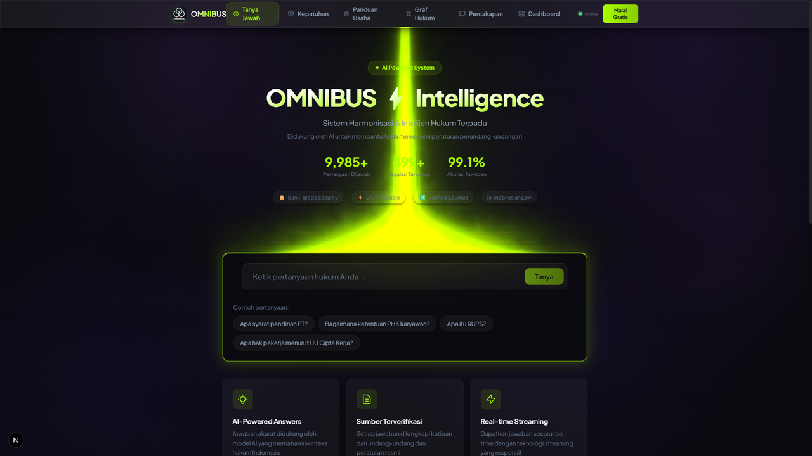
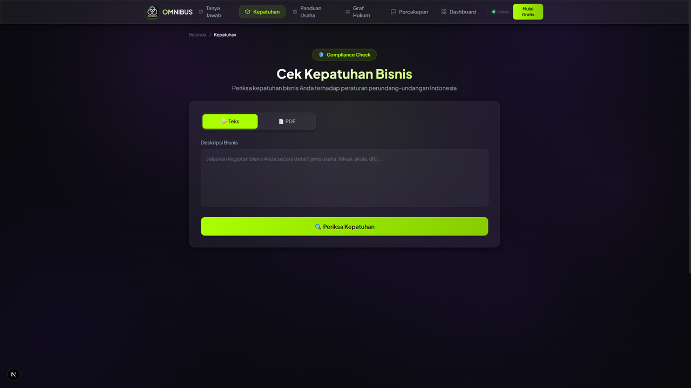
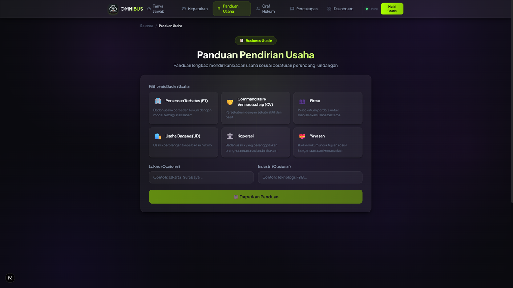
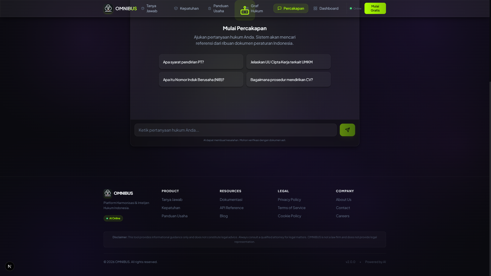
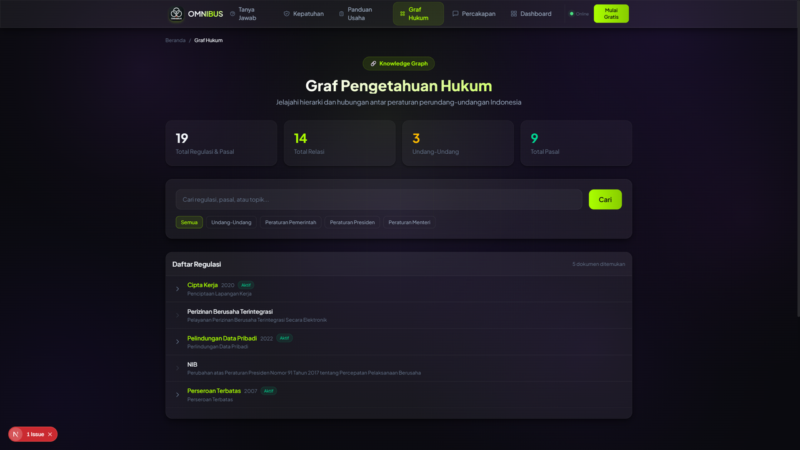
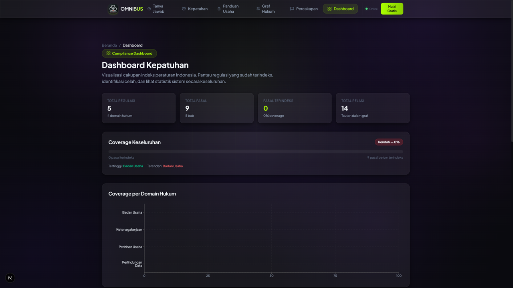

<div align="center">


# Omnibus Legal Compass

**AI-Powered Indonesian Legal Intelligence Platform**

[](https://github.com/vaskoyudha/Omnibus-intelligence/actions/workflows/ci.yml)
[](https://opensource.org/licenses/MIT)
[](https://python.org)
[](https://nextjs.org)
[](https://fastapi.tiangolo.com)
[](tests/)

Navigate Indonesian regulations with confidence. Ask legal questions, check compliance, get business guidance — all backed by hybrid search, cross-encoder reranking, and source citations.

[**Documentation**](https://vaskoyudha.github.io/Omnibus-intelligence/) · [**Report Bug**](https://github.com/vaskoyudha/Omnibus-intelligence/issues/new?template=bug_report.yml) · [**Request Feature**](https://github.com/vaskoyudha/Omnibus-intelligence/issues/new?template=feature_request.yml)

</div>

---

## Why Omnibus Legal Compass?

Most legal AI tools are **keyword matchers dressed up as AI**. Omnibus is different:

- **Hybrid Search + Reranking** — BM25 sparse retrieval meets dense vector search, refined by CrossEncoder reranking. Not just "find similar words" — actual semantic understanding.
- **Source Citations on Every Answer** — Every response links back to specific regulation articles. Verify, don't trust blindly.
- **Indonesia-Deep, Not Indonesia-Shallow** — Purpose-built for Indonesian legal framework: UU, PP, Perpres, Perda. Not a generic chatbot with an Indonesian prompt.
- **Knowledge Graph** — Regulations aren't isolated. Our graph maps cross-references, amendments, and hierarchies between legal documents.
- **Production-Ready** — Rate limiting, API versioning, 294 passing tests, CI/CD, structured error handling. Not a weekend prototype.

---

## Features

### Legal Q&A with Citations
Ask any question about Indonesian regulations. Get accurate answers with direct citations to source documents (UU, PP, Perpres).

### Compliance Checker
Describe your business operations or upload a PDF — get a compliance assessment against current regulations with specific recommendations.

### Business Formation Guidance
Step-by-step guidance for establishing a business in Indonesia: required permits, regulatory steps, estimated timelines, and issuing authorities.

### Multi-Turn Chat
Conversational interface with session memory. Ask follow-up questions without repeating context. 10-message sliding window keeps conversations focused.

### Knowledge Graph
Visual tree-view of legal document relationships: hierarchies, cross-references, and amendments. Understand how regulations connect.

### Compliance Dashboard
Heat map and bar chart visualization of regulatory coverage across legal domains. See where your compliance gaps are.

---

## Screenshots

| Legal Q&A | Compliance Checker | Business Guidance |
|:-:|:-:|:-:|
|  |  |  |

| Multi-Turn Chat | Knowledge Graph | Dashboard |
|:-:|:-:|:-:|
|  |  |  |

---

## Architecture

```
+---------------------------------------------------------------+
|                      Next.js Frontend                         |
|  +----------+ +------------+ +----------+ +-------+ +------+ |
|  | Q&A Page | | Compliance | | Guidance | |  Chat | | Dash | |
|  +----------+ +------------+ +----------+ +-------+ +------+ |
+-----------------------------+---------------------------------+
                              | HTTP / REST
+-----------------------------v---------------------------------+
|                      FastAPI Backend                           |
|  +-----------+ +-------------+ +----------+ +---------------+ |
|  | /api/v1/* | | Rate Limit  | | Sessions | | Knowledge     | |
|  | Endpoints | | (slowapi)   | | Manager  | | Graph Engine  | |
|  +-----+-----+ +-------------+ +----------+ +---------------+ |
|        |                                                       |
|  +-----v-----------------------------------------------------+ |
|  |                     RAG Chain                              | |
|  |  +----------------+     +------------------------------+  | |
|  |  | Hybrid Search  |---->| NVIDIA NIM (Kimi K2)        |  | |
|  |  | BM25 + Dense   |     | moonshotai/kimi-k2-instruct |  | |
|  |  +-------+--------+     +------------------------------+  | |
|  |          |  CrossEncoder Reranking                         | |
|  +----------+-------------------------------------------------+ |
+--------------+--------------------------------------------------+
               |
+--------------v--------------------------------------------------+
|                      Qdrant Vector DB                           |
|  Collection: indonesian_legal_docs                              |
|  Embeddings: paraphrase-multilingual-MiniLM-L12-v2 (384 dim)   |
+-----------------------------------------------------------------+
```

---

## Tech Stack

| Layer | Technology | Purpose |
|-------|-----------|---------|
| **LLM** | [NVIDIA NIM](https://build.nvidia.com/) (Kimi K2) | Legal reasoning & answer generation |
| **Embeddings** | `paraphrase-multilingual-MiniLM-L12-v2` | Multilingual semantic search (384 dim) |
| **Vector DB** | [Qdrant](https://qdrant.tech/) | Hybrid search (BM25 + dense vectors) |
| **Reranker** | CrossEncoder | Result relevance refinement |
| **Backend** | [FastAPI](https://fastapi.tiangolo.com/) + Python | API server, RAG pipeline, rate limiting |
| **Frontend** | [Next.js 16](https://nextjs.org/) + React 19 | UI with Tailwind CSS + Framer Motion |
| **Visualization** | [Recharts](https://recharts.org/) | Dashboard charts and heat maps |
| **Graph** | [NetworkX](https://networkx.org/) | Knowledge graph storage & traversal |
| **Testing** | pytest + Vitest | 294 backend + 23 frontend tests |
| **CI/CD** | GitHub Actions | Automated testing & docs deployment |
| **Docs** | [VitePress](https://vitepress.dev/) | Documentation site on GitHub Pages |

---

## Quick Start

### Prerequisites

- **Docker** — [Install Docker](https://docs.docker.com/get-docker/)
- **Python 3.11+** — [Install Python](https://www.python.org/downloads/)
- **Node.js 18+** — [Install Node.js](https://nodejs.org/)
- **NVIDIA NIM API Key** (free tier available) — [Get API Key](https://build.nvidia.com/)

### 1. Clone & Configure

```bash
git clone https://github.com/vaskoyudha/Omnibus-intelligence.git
cd "Omnibus-intelligence"
cp .env.example .env
# Edit .env and add your NVIDIA_API_KEY
```

### 2. Start Qdrant

```bash
docker run -d --name omnibus-qdrant \
  -p 6333:6333 -p 6334:6334 \
  -v qdrant_storage:/qdrant/storage \
  qdrant/qdrant:latest
```

### 3. Backend Setup

```bash
python -m venv venv
# Windows: .\venv\Scripts\activate
# Linux/macOS: source venv/bin/activate
pip install -r requirements.txt

cd backend
python scripts/ingest.py   # Ingest legal documents
uvicorn main:app --host 0.0.0.0 --port 8000 --reload
```

### 4. Frontend Setup

```bash
# In a new terminal
cd frontend
npm install
echo "NEXT_PUBLIC_API_URL=http://localhost:8000" > .env.local
npm run dev
```

### 5. Open

- **App**: [http://localhost:3000](http://localhost:3000)
- **API Docs**: [http://localhost:8000/docs](http://localhost:8000/docs)

---

## API Preview

All endpoints are versioned under `/api/v1/`. Full reference in [API Documentation](https://vaskoyudha.github.io/Omnibus-intelligence/api-reference).

```bash
# Legal Q&A
curl -X POST http://localhost:8000/api/v1/ask \
  -H "Content-Type: application/json" \
  -d '{"question": "Apa syarat pendirian PT?"}'

# Compliance Check
curl -X POST http://localhost:8000/api/v1/compliance/check \
  -H "Content-Type: application/json" \
  -d '{"business_description": "Perusahaan ekspor impor dengan NIB"}'

# Business Guidance
curl -X POST http://localhost:8000/api/v1/guidance \
  -H "Content-Type: application/json" \
  -d '{"business_type": "PT", "industry": "teknologi", "location": "Jakarta"}'
```

---

## Competitive Comparison

How does Omnibus Legal Compass compare to other legal AI projects?

| Feature | Omnibus Legal Compass | LaWGPT (China) | Lawyer LLaMA (China) | Fuzi.Mingcha (China) | AI Legal Compliance (USA) |
|---|:---:|:---:|:---:|:---:|:---:|
| **Jurisdiction** | Indonesia | China | China | China | USA |
| **Frontend UI** | Next.js 16 + Tailwind | None | None | Gradio | Streamlit |
| **Hybrid Search** (BM25 + Dense) | Yes | No | No | No | No |
| **CrossEncoder Reranking** | Yes | No | No | No | No |
| **Knowledge Graph** | Yes | No | No | No | No |
| **Multi-Turn Chat** | Yes (session memory) | No | No | No | No |
| **Compliance Dashboard** | Yes (heat map + charts) | No | No | No | No |
| **Source Citations** | Every response | No | No | Partial | Partial |
| **Streaming Responses** | Yes | N/A | N/A | No | No |
| **API Versioning** | `/api/v1/*` | No | No | No | No |
| **Rate Limiting** | Yes (slowapi) | No | No | No | No |
| **Test Coverage** | 294+ tests (91%) | Minimal | Minimal | None | None |
| **CI/CD** | GitHub Actions | No | No | No | No |
| **Documentation Site** | VitePress | Minimal | README only | README only | README only |

> **Note**: Comparison based on publicly available repositories as of Feb 2025. Omnibus is the only Indonesian-focused legal AI with a full-stack production architecture.

For detailed analysis, see [Competitive Comparison](https://vaskoyudha.github.io/Omnibus-intelligence/comparison).

---

## Environment Variables

| Variable | Description | Default |
|----------|-------------|---------|
| `NVIDIA_API_KEY` | NVIDIA NIM API key | **Required** |
| `QDRANT_URL` | Qdrant database URL | `http://localhost:6333` |
| `NEXT_PUBLIC_API_URL` | Backend URL for frontend | `http://localhost:8000` |

---

## Project Structure

```
Regulatory Harmonization Engine/
├── backend/
│   ├── main.py                    # FastAPI app, all routes, rate limiting
│   ├── rag_chain.py               # RAG chain with NVIDIA NIM
│   ├── retriever.py               # Hybrid search (BM25 + dense + reranking)
│   ├── chat/
│   │   └── session.py             # Multi-turn session manager
│   ├── knowledge_graph/
│   │   ├── schema.py              # Pydantic models (Law, Article, etc.)
│   │   ├── graph.py               # NetworkX graph operations
│   │   ├── ingest.py              # Document-to-graph ingestion
│   │   └── persistence.py         # JSON serialization
│   ├── dashboard/
│   │   ├── coverage.py            # Coverage computation engine
│   │   └── metrics.py             # Pydantic response models
│   └── scripts/
│       └── ingest.py              # Vector DB document ingestion
├── frontend/
│   └── src/
│       ├── app/
│       │   ├── page.tsx               # Legal Q&A
│       │   ├── compliance/page.tsx    # Compliance checker
│       │   ├── guidance/page.tsx      # Business guidance
│       │   ├── chat/page.tsx          # Multi-turn chat
│       │   ├── knowledge-graph/page.tsx # Knowledge graph tree
│       │   └── dashboard/page.tsx     # Coverage dashboard
│       ├── components/
│       │   └── Navbar.tsx             # Navigation (6 pages)
│       └── lib/
│           └── api.ts                 # API client (all endpoints)
├── tests/                         # 294 backend tests (91% coverage)
├── docs/                          # VitePress documentation site
├── .github/
│   ├── workflows/ci.yml           # CI pipeline
│   ├── workflows/docs.yml         # Docs deployment
│   ├── ISSUE_TEMPLATE/            # Bug, feature, good first issue
│   └── PULL_REQUEST_TEMPLATE.md
├── .env.example
├── .pre-commit-config.yaml        # Secret detection hooks
├── LICENSE                        # MIT
├── CODE_OF_CONDUCT.md
├── SECURITY.md
└── requirements.txt
```

---

## Testing

```bash
# Run all backend tests (294 tests)
python -m pytest tests/test_api.py tests/test_api_versioning.py \
  tests/test_chat.py tests/test_rag_chain.py tests/test_retriever_unit.py \
  tests/test_rate_limit.py tests/test_knowledge_graph.py \
  tests/test_knowledge_graph_ingest.py tests/test_graph_api.py \
  tests/test_dashboard.py -v --tb=short

# Run with coverage
python -m pytest tests/test_api.py tests/test_api_versioning.py \
  tests/test_chat.py tests/test_rag_chain.py tests/test_retriever_unit.py \
  tests/test_rate_limit.py tests/test_knowledge_graph.py \
  tests/test_knowledge_graph_ingest.py tests/test_graph_api.py \
  tests/test_dashboard.py --cov=backend --cov-report=term-missing

# Run frontend tests
cd frontend && npm test
```

---

## Contributing

We welcome contributions! Please see our [Contributing Guide](CONTRIBUTING.md) for details on:

- Development environment setup
- Coding standards and commit conventions
- Pull request process
- Good first issues for new contributors

---

## Security

Found a vulnerability? Please report it responsibly. See [SECURITY.md](SECURITY.md) for our disclosure policy.

---

## License

This project is licensed under the MIT License. See [LICENSE](LICENSE) for details.

---

## Legal Disclaimer

Omnibus Legal Compass is an **AI-assisted research tool**. It does **not** constitute legal advice. Always consult a qualified legal professional for legal decisions. The developers assume no liability for actions taken based on this tool's output.

---

<div align="center">

**[Documentation](https://vaskoyudha.github.io/Omnibus-intelligence/)** · **[Report Bug](https://github.com/vaskoyudha/Omnibus-intelligence/issues/new?template=bug_report.yml)** · **[Request Feature](https://github.com/vaskoyudha/Omnibus-intelligence/issues/new?template=feature_request.yml)**

Built for Indonesian Legal Tech

</div>
